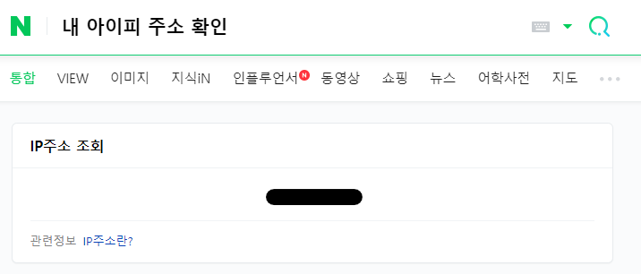

시놀로지 나스를 쓰면서 토렌트를 위해 Download Station을 이용하여 잘 쓰고 있었다.  
우연히 VPN을 이용하여 안전하게 사용하는 방법을 알게 되어 적용해보았다.  
시놀로지에 VPN을 적용하게 되면 외부에서 접근이나 다른 서비스들의 네트워크 속도에 영향이 있을 수 있기 때문에 따로 동작할 수 있는 방법을 찾게 되었고 발견하게 된게 Transmission 과 VPN을 세팅할 수 있는 Docker 이미지 였다.  
- 도커 이미지
  - <https://hub.docker.com/r/haugene/transmission-openvpn>
- 가이드 문서
  - <https://haugene.github.io/docker-transmission-openvpn/>

혼자 사용하려고 만들었다가 공유하기 위해서 오픈소스로 올렸다고 한다.(감사합니다👍)  

간단하게 셋팅할 수 있도록 가이드를 작성해보겠다.  
  
## Docker 설치
Docker를 사용하기 위해서 Synology에서 패키지센터를 통해 Docker를 설치한다.  

_docker 설치 완료_


Docker를 설치 후 Synology에 ssh로 접근하고, 아래 명령어를 통해 docker-compose도 잘 설치되었는지 버전을 확인을 해본다.  
```bash
docker-compose version
```
실행결과  
```bash
$ docker-compose version
docker-compose version 1.28.5, build 324b023a
docker-py version: 4.4.4
CPython version: 3.7.10
OpenSSL version: OpenSSL 1.1.0l  10 Sep 2019
```
에러 메세지 없이 버전이 나오면 성공이다.  
**docker와 docker-compose의 차이**  
docker
: 하나의 컨테이너 실행  

docker-compose
: 여러 컨테이너를 yaml file로 세팅하여 한번에 실행
  
  
## docker-compose.yaml 작성
이제 docker-compose.yaml 파일을 작성해야한다.  
아래는 가이드 문서에 나온 docker-compose.yml의 예시.  
```yaml
version: '3.3'
services:
    transmission-openvpn:
        cap_add:
            - NET_ADMIN
        volumes:
            - '/your/storage/path/:/data'
        environment:
            - OPENVPN_PROVIDER=PIA
            - OPENVPN_CONFIG=france
            - OPENVPN_USERNAME=user
            - OPENVPN_PASSWORD=pass
            - LOCAL_NETWORK=192.168.0.0/16
        logging:
            driver: json-file
            options:
                max-size: 10m
        ports:
            - '9091:9091'
        image: haugene/transmission-openvpn
```
{: file='docker-compose.yaml - example'}
  

가이드 문서에 나온대로 사용할 docker-compose.yml을 만들어봤다.  
```yaml
version: '3.3'
services:
    transmission-openvpn:
        restart: always
        cap_add:
            - NET_ADMIN
        volumes:
            - '/volume1/500/transmission/:/data'
        environment:
            - OPENVPN_PROVIDER=EXPRESSVPN
            - OPENVPN_USERNAME=${OPENVPN_USERNAME}
            - OPENVPN_PASSWORD=${OPENVPN_PASSWORD}
            - OPENVPN_CONFIG=my_expressvpn_south_korea_-_2_udp
            - OPENVPN_OPTS=--inactive 3600 --ping 10 --ping-exit 60
            - LOCAL_NETWORK=192.168.0.0/24
            - TZ=Asia/Seoul
            - HEALTH_CHECK_HOST=google.com
            - TRANSMISSION_WEB_UI=flood-for-transmission
            - TRANSMISSION_RPC_AUTHENTICATION_REQUIRED=true
            - TRANSMISSION_RPC_HOST_WHITELIST="127.0.0.1,192.168.0.*"
            - TRANSMISSION_RPC_HOST_WHITELIST_ENABLED=true
            - TRANSMISSION_RPC_PASSWORD=${TRANSMISSION_RPC_PASSWORD}
            - TRANSMISSION_RPC_USERNAME=${TRANSMISSION_RPC_USERNAME}
            - TRANSMISSION_SCRAPE_PAUSED_TORRENTS_ENABLED=false
            - TRANSMISSION_WATCH_DIR_ENABLED=true
            - TRANSMISSION_WATCH_DIR=/data/torrentfile
        logging:
            driver: json-file
            options:
                max-size: 10m
        ports:
            - '9091:9091'
        image: haugene/transmission-openvpn
    proxy:
        image: haugene/transmission-openvpn-proxy
        links:
            - transmission-openvpn
        ports:
            - 7002:7002
```
{: file='docker-compose.yaml'}
  

최대한 하나씩 설정들을 살펴보며 설명을 해보겠다.
### volumes
```yaml
        volumes:
            - '/volume1/500/transmission/:/data'
```
{: file='docker-compose.yaml - volume'}
Synology /volume1/500/transmission/의 경로와 docker의 /data/ 경로를 바인드 시켜 transmission의 데이터를 Synology 디스크 공간에 저장할 수 있게 된다.  
원하는 경로로 설정하면 된다.  
  
  
### environment 
```yaml
        environment:
            - OPENVPN_PROVIDER=EXPRESSVPN
            - OPENVPN_USERNAME=${OPENVPN_USERNAME}
            - OPENVPN_PASSWORD=${OPENVPN_PASSWORD}
            - OPENVPN_CONFIG=my_expressvpn_south_korea_-_2_udp
            - OPENVPN_OPTS=--inactive 3600 --ping 10 --ping-exit 60
            - LOCAL_NETWORK=192.168.0.0/24
            - TZ=Asia/Seoul
            - HEALTH_CHECK_HOST=google.com
            - TRANSMISSION_WEB_UI=flood-for-transmission
            - TRANSMISSION_RPC_AUTHENTICATION_REQUIRED=true
            - TRANSMISSION_RPC_HOST_WHITELIST="127.0.0.1,192.168.0.*"
            - TRANSMISSION_RPC_HOST_WHITELIST_ENABLED=true
            - TRANSMISSION_RPC_PASSWORD=${TRANSMISSION_RPC_PASSWORD}
            - TRANSMISSION_RPC_USERNAME=${TRANSMISSION_RPC_USERNAME}
            - TRANSMISSION_SCRAPE_PAUSED_TORRENTS_ENABLED=false
            - TRANSMISSION_WATCH_DIR_ENABLED=true
            - TRANSMISSION_WATCH_DIR=/data/torrentfile
```
{: file='docker-compose.yaml - environment'}
- OPENVPN_PROVIDER : 가이드 문서에 따르면 여러 프로바이더를 지원한다. 사용하는 VPN Value를 작성하면 된다. ExpressVPN을 사용하기 때문에 해당 값을 넣었다. [참고](https://haugene.github.io/docker-transmission-openvpn/supported-providers/)  
- OPENVPN_USERNAME : ExpressVPN 사용자명
- OPENVPN_PASSWORD : ExpressVPN 비밀번호
  - ExpressVPN 사용자명, 비밀번호 알아내는 법
    1. ExpressVPN 로그인 후 장치 설정 접근
    
    _ExpressVPN 장치 설정_
    2. 수동 구성 접근
    
    _ExpressVPN 수동 구성_
    3. 오른쪽에 사용자명, 비밀번호 확인
    
    _ExpressVPN 사용자명, 비밀번호 확인_
- OPENVPN_CONFIG : VPN을 어느 지역으로 연결하여 사용할 지 작성된 .ovpn 파일
  - [vpn-configs-contrib/github](https://github.com/haugene/vpn-configs-contrib/tree/main/openvpn)에 보면 여러 VPN의 .ovpn 파일이 미리 업로드 되어있다. 이 중에 사용할 .ovpn 파일 이름을 그대로 적으면 된다. 한국으로 연결하여 사용하기 위해서 `my_expressvpn_south_korea_-_2_udp` 으로 적었다.
- OPENVPN_OPTS : OpenVPN에 적용할 옵션
  - [OpenVPN reference](https://openvpn.net/community-resources/reference-manual-for-openvpn-2-0/)에 참고하여 파라미터로 값을 넘겨주면 된다.
- LOCAL_NETWORK : Synology가 실행되는 네트워크 대역으로 설정하면 될 것 같다.
  - CIDR 형태로 ,(콤마)를 사용하여 여러개를 지정할 수 있다. 
- TZ : 타임존 설정.
  - 당연히 서울로 지정.
- HEALTH_CHECK_HOST : 5분 간격으로 Docker 컨테이너가 인터넷이 가능한지 체크하기 위한 주소값이다. VPN 연결이 실패할 경우 감지하기 위함인 것 같다.
  - Default 값이 `google.com` 이지만 지정해줬다.
- TRANSMISSION_WEB_UI : Transmission의 WEB UI 설정. 여러개가 있지만 가장 ui가 깔끔해 보이는 `flood-for-transmission`로 지정.
  - `combustion`, `kettu`, `transmission-web-control`, `flood-for-transmission`, `shift`
- TRANSMISSION_RPC_AUTHENTICATION_REQUIRED : Transmission 접근 시 인증 절차를 적용할 건지 선택.
  - `true` or `false`
- TRANSMISSION_RPC_HOST_WHITELIST : Transmission 접근 시 허용할 IP 주소 목록. Whitelist(화이트리스트)
  - 외부에서 접근이 필요없기 때문에 로컬 IP 주소 및 Synology 네트워크 대역을 지정했다.
- TRANSMISSION_RPC_HOST_WHITELIST_ENABLED : Transmission 접근 시 Whitelist 기능을 적용할 건지 선택.
  - `true` or `false`
- TRANSMISSION_RPC_PASSWORD : 인증 절차에 사용할 비밀번호
- TRANSMISSION_RPC_USERNAME : 인증 절차에 사용할 사용자 이름
- TRANSMISSION_SCRAPE_PAUSED_TORRENTS_ENABLED : 전송이 중지된 토렌트에 대해서 스크랩을 적용할 건지 선택. 필요없는 기능같기도 해서 `false`로 선택했다.
  - `true` or `false`
- TRANSMISSION_WATCH_DIR_ENABLED : Transmission이 특정 경로를 감시할 건지 선택. 적용되면 특정 경로의 torrenfile을 읽어 자동으로 등록하고 다운로드를 시작한다. 
  - `true` or `false`
- TRANSMISSION_WATCH_DIR : Transmission이 감시할 경로
- 추가로 Transmission에 적용할 옵션들은 [링크](https://github.com/transmission/transmission/wiki/Editing-Configuration-Files)에서 찾아서 TRANSMISSIOPN_대문자+언더바 형식으로 적용하면 된다.
  
  
### port
```yaml
        ports:
            - '9091:9091'
        image: haugene/transmission-openvpn
```
- ports : Transmission을 WEB으로 접근할 PORT
  
  
  
### proxy
```yaml
    proxy:
        image: haugene/transmission-openvpn-proxy
        links:
            - transmission-openvpn
        ports:
            - 7002:7002
```
프록시 설정을 위한 부분. 외부에서 접근하려면 필요하다. 외부에서 접근하기 위한 ports를 변경해주면 된다.  
  


## docker-compose.yml 실행
2번에서 작성한 doker-compose.yml을 적당한 경로에 옮기고 해당 경로에서 아래와 같은 명령어를 입력한다.  
```bash
docker-compose up -d
```
실행결과
```bash
$ docker-compose up -d
Creating transmission-openvpn_transmission-openvpn_1 ... done
Creating transmission-openvpn_proxy_1                ... done
```
에러 없이 잘 실행 되면 된다.  
  
  
## Transmission WEB UI 접근
실행을 했으니 정상적으로 잘 동작하는지 확인 하기 위해서 WEB UI에 접근을 해보겠다.  
Synology가 공유기에서 할당 받은 로컬 아이피와 위에서 설정한 port를 이용해 접근을 하면 된다.  

_flood-for-transmission_
  

## VPN 적용 확인
접근이 잘 되니 이제 VPN설정이 잘 되는 지 확인이 필요하다.
- <https://ipleak.net/>  

위 사이트로 접근하여 `Torrent Address detection` 항목의 `Activate` 버튼을 클릭한다.  

_Torrent Address detection_

_Torrent Address detection_
누른 후 마그넷 링크가 화면에 표시되고 해당 마그넷 링크를 transmission에 추가를 하면 된다.  

_flood-for-transmission + 버튼 누르기_

_flood-for-transmission 마그넷 링크 붙여넣기_

_flood-for-transmission 다운로드 항목에 추가된 모습_
  
`flood-for-transmission` 기준 오른쪽 상단 위에 `+` 버튼을 누르고, 마그넷 링크를 붙여넣기 후 `Add Torrent` 버튼을 누르면 된다.  
  

_ipleak에 IP가 표시되는 화면_

_naver에 내 아이피 주소 확인 화면_
다운로드 항목에 추가가 되면 ipleak 페이지에 해당 마그넷으로 다운로드 중인 피어의 IP가 표시가 된다. 해당 IP 주소가 같은 공유기에 물려있는 PC로 네이버에 `내 아이피 주소 확인`을 검색한 후 표시되는 IP와 다르게 표시가 된다면 성공이다.  
  