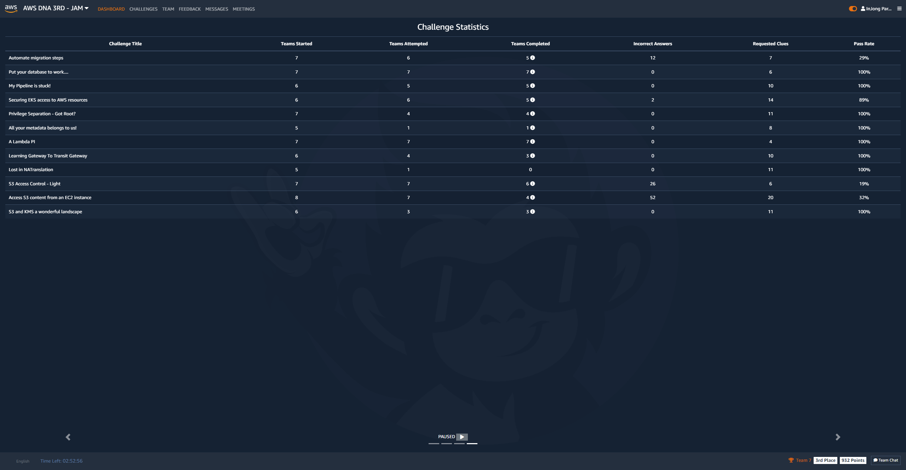

### AWS DNA (Digital Native Architect)
 
열심히 업무에 치이던 어느날 팀장님한테서 메일을 받게 되었는데 `AWS DNA 3기`를 모집한다는 메일이였다. 팀장님이 DNA 2기를 진행하고나서 유익했는지 나보고 참여하면 좋겠다고 추천을 해준 것 이였다. ([팀장님 후기](https://www.bogeun.io/50689135-8d99-434f-92d2-4a7c46294eb8))  
AWS를 3년 가까이 다루면서 유지보수성 업무들만 처리하면서 개인적인 공부는 미루다 보니 사실상 성장은 뒤쳐진 편이였다.  
AWS DNA를 통해서 기존에 사용하지 않던 유용한 기술들을 공부할 수 있고 다른 회사의 사람들과의 소통을 통해 성장의 자극을 받을 좋은 기회라 생각되어 참여하기로 마음먹었다. 
[랜딩페이지](https://pages.awscloud.com/kr-aws-dna-online-reg.html)를 통해 AWS DNA 프로그램에 관련하여 간략하게 알 수 있었다. 
  
#### AWS DNA
 
- AWS DNA 프로그램은 선별된 인원으로 운영되는 새로운 방식의 교육 및 네트워킹 프로그램입니다. 다양한 사업의 요구 및 문제를 실무적으로 해결하는 케이스를 데모와 함께 심화학습으로 제공합니다. AWS DNA 3기 멤버들은 3개월 동안 팀으로 구성하여, 온라인 세션과 AWS JAM 게임 대회(Hands-on-Lab Competition)를 진행합니다.

#### AWS JAM
 
- 주어진 특정 시나리오에 대해서 팀원들과 함께 아키텍처를 정확하고 빠르게 구성해 포인트를 얻어가며 다른 팀과 경쟁하는 게임 대회입니다.

<!--([소개영상](https://www.youtube.com/watch?v=dSqKmmZsMK4))-->   
  
#### 프로그램 혜택
 
- DNA 3기 웰컴 바우처
- DNA 3기 수료자 - 소정의 상품 제공
- DNA 3기 AWS JAM 대회 입상 – 특별 상품 제공
- AWS 자격증 할인 응시 기회
- DNA 멤버들과의 지속적인 네트워킹

#### 아젠다
 
| 일정      | 아젠다                                                                    | 
|:----------|-------------------------------------------------------------------------:| 
| 09월 09일 | Peak Load Control with AWS Serverless (서태종, AWS 솔루션즈 아키텍트)      | 
| 09월 16일 | Full Serverless App with React and Amplify (정우철, AWS 솔루션즈 아키텍트) | 
| 09월 30일 | AWS Hybrid Networking (최우형, AWS 솔루션즈 아키텍트)                      | 
| 10월 07일 | Case sharing                                                             | 
| 10월 14일 | Well-architected containers with DevOps (김영욱, AWS 솔루션즈 아키텍트)    | 
| 10월 21일 | Effective Operation Patterns (정영민, AWS 솔루션즈 아키텍트)               | 
| 10월 28일 | AWS JAM 경연 대회                                                         | 
  
  
랜딩페이지에 참여를 등록한다고 해서 누구나 DNA에 참여할 수 있는 건 아니였다;; 설명회를 진행하고 설명회가 끝난 후 간단한 서베이를 통해 DNB팀이 내부적으로 3기 멤버를 선정을 한다고 했다. (안될까봐 조마조마 했다...)  
다행히도 서베이에 정성을 담아 작성해서 그런가 3기 멤버로 선정되었다는 메일을 받을 수 있었다.  

_AWS DNA 3기 멤버 선정 합격 메일_
  
### 세션 후기
 
이후 일정대로 AWS Chime을 통해 세션들이 진행되었고 세션은 매주 목요일 퇴근 후 약속의 19시에 실시간으로 들을 수 있었다. 첫 세션이 시작되기 전에 팀을 배정 받았고 참여하는 DNA 멤버들의 3초컷 자기소개를 진행 했다. 정말 여러 회사의 사람들이 참여하여 신기하기도 하고 설레기도 했다. 세션 진행 하루나 이틀전에 미리 발표 자료가 공유되어 내용에 대해서 미리 숙지할 수 있었고 발표 내용의 기술 숙련도를 미리 조사하여 발표 내용의 수준을 조정했다. DNB팀에서 DNA에 참여하는 멤버들을 최대한 배려하려고 노력한 모습들이 보였다.  
각 세션마다 HOL(Hands-on-Lab)이라고 세션을 듣고 그대로 실습하는 과정인데 잘 작성된 가이드에 따라서 개인 AWS Account에 직접 AWS 리소스를 하나하나 생성하고 결과를 볼 수 있었다. 그리고 과제를 각 팀별로 팀 구성원 전원이 정해진 기한까지 완료하면 소정의 상품을 받는 재미도 쏠쏠했다.  
모든 세션의 내용은 실무에 적용할만한 기술들을 위주로 진행되어 정말 유익했다. 서비스를 하면서 고민할만한 이슈들을 위주로 세션들이 잘 구성된 것 같다. 특히 10월 07일 진행한 Case sharing에서는 DNA 멤버들이 직접 비즈니스에서 겪었던 사례들을 공유하는 시간이였는데 다른회사 선배님들이 겪은 고민을 들어볼 수 있어서 색다르지만 많은 공감이 되는 내용이였다. 
  
### JAM 게임 대회
 
AWS DNA의 하이라이트 JAM 게임 대회.  
 
게임 형식으로 다양한 비즈니스 사례를 바탕으로 다양한 영역에서 발생할 수 있는 문제점을 AWS 서비스를 해결하는 과정이다.  
  
#### JAM 게임 대회 후기
총 12개의 문제를 2시간동안 진행했으며 난이도에 따라서 받을 수 있는 점수가 다르다. 당연히 어려운 문제일수록 점수가 높다. 그리고 문제마다 힌트가 있는데 힌트를 열람할 때 마다 문제를 풀고 보상받는 점수가 깎이게 된다. 2시간 내에 12개의 문제를 전부 풀지 못할 수 도 있기 때문에 적절하게 힌트를 사용하여 빠르게 다음 문제로 넘어가는 전략도 필요했던 것 같다.  
우리팀은 나름 전략적으로 시간은 기다려주지 않으니 우선 제일 쉬운 난이도를 4명이서 각각 하나씩 맡아 풀어보고 다른 문제들은 어떻게 풀어나갈지 다시 의논하기로 했다. JAM 대시보드에도 팀 채팅은 있었지만 원할한 소통을 위해 우린 구글밋을 통해 실시간으로 서로가 풀고 있는 문제에 대해서 의논하면서 진행했다. 어찌 저찌 힘들게 4개의 문제를 풀고 나니 2시간이 지나 대회가 종료되었다..(?띠용) 생각보다 처음에 문제를 어떻게 푸는건지 파악하는데 오래걸린 것 같았다. 팀원분들이 다들 AWS에 능숙하지 않다고 하셨는데 대회는 3등으로 마무리 했다. 능숙했으면 1등 했을 뻔 했다. 그리고 놀랍게도 대회 중간에 1등을 기록하기도 했다. 다들 기대하지 않은 성적이라 엄청 좋아했다.  

내가 대회 종료까지 푼 문제는 총 4개이며 대략 내용을 설명하면 아래와 같다.  
 
S3 Access Control  
- S3 Access Control을 적절하게 조정하고 static website 페이지를 접근하면 코드를 확인 할 수 있었고 정답으로 제출하면 됐다.
 
Put your database to work  
- 기존 인스턴스에 접근하지 않고 php 소스를 수정해 신규 RDS로 연결하면 성공. AWS System Manager를 통해 php dbinfo를 수정했다.
 
A Lambda PI  
- API Gateway에서 Lambda proxy를 통해 response를 받으려 하는데 제대로 넘어오지 않는 문제. API Gateway가 Lambda의 response를 처리하려면 JSON 형식이여야 해서 Lambda 함수를 수정해서 기다리면 알아서 시스템에서 체크하여 문제가 풀림.
 
Learning Gateway To Transit Gateway  
- Transit Gateway로 구성된 3개의 VPC에서 public한 EC2에서 private한 EC2에 접근할 수 있도록 구성하면 문제를 풀어감.
  
#### JAM 게임 대회 대시보드
 

_AWS JAM Dashboard Leaderboard_

_AWS JAM Dashboard Challenge Statistics_

_AWS JAM Dashboard Scoring Trends_

_AAWS JAM Dashboard Time Left_

_AWS JAM Dashboard 팀 점수_

_AWS JAM Dashboard 중간에 1등한 모습_
  
### 짧은 마무리
 
짧기도 하고 길기도 한 2개월 간 진행된 AWS DNA 3기 과정은 내가 원했던 성장의 자극을 충분히 주었고 전혀 아깝지 않은 시간이였다. 기회가 된다면 꼭 참여하면 좋을 것 같다.  
다음 나의 목표는.. AWS 자격증이다!.  
  
### 수료 선물
  

_AWS DNA GIFT_

_AWS 로고가 있는 후드티, 마우스 패드_

_AWS 로고가 있는 마우스 패드_
   