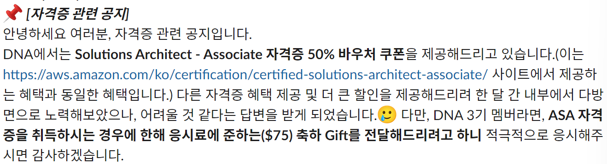
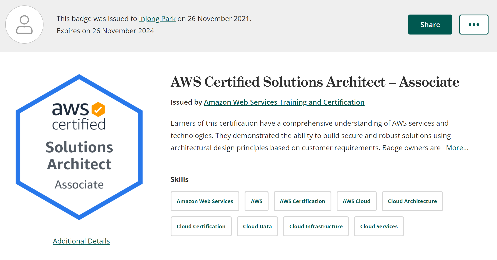

  
### 자격증 시험을 본 이유
 평소에 AWS를 다루면서 내가 어느정도의 지식들을 갖고 있는지 잘 모르기도 해서 수준을 확인하고 좀 더 전문적인 지식들을 얻기위해 자격증 시험을 치루고 취득하면 어떨까 생각을 했었다. 운이 좋게 [AWS DNA 3기](https://parkinjong.github.io/posts/aws-dna-3%EA%B8%B0-%ED%9B%84%EA%B8%B0/)가 끝나갈 때 쯤 DNA 멤버들에게 Solutions Architect - Associate(SAA) 자격증 50% 바우처 쿠폰을 제공한다고 하여 이 기회에 취득하는게 좋겠다 하여 시험을 예약했다. (Gift가 뭔지도 궁금했다...)  
   

_AWS DNA 3기 Slack 내용_
  
### AWS 자격증이란?
 AWS Certification은 특별한 지식, 기술 및 역량을 보유했음을 증명한 개인에게 AWS가 발급하는 자격증입니다. AWS 전문가와 협력하여 일반적인 클라우드 작업 역할에 필요한 경험과 특정 기술 분야에서 전문성의 기준을 세우고 있습니다. AWS Certification 시험 중 하나에 응시하여 통과하면 이 기준을 충족했음을 증명할 수 있습니다. 그러면 AWS에서 AWS Certification을 부여합니다.  - [출처](https://aws.amazon.com/ko/certification/certification-prep/?ch=cta&cta=header&p=2)
  
### 공부 방법
 udemy에서 제공하는 [AWS Certified Solutions Architect Associate Practice Exams](https://www.udemy.com/course/aws-certified-solutions-architect-associate-amazon-practice-exams-saa-c02/)을 이용했다. 실제 시험과 같이 객관식 65문제로 구성된 총 6개의 테스트가 있고 1개의 테스트를 풀고 나면 바로 점수가 나오고 오답과 함께 모든 문제에 대한 해설을 볼 수 있다. 1개의 테스트를 풀 때 마다 애매한 문제들과 오답이 나온 문제들 위주로 정리를 하고 다음 테스트를 진행했다. 공부를 안하고 문제를 풀다보니 1 ~ 4 번째 테스트는 70%를 못 넘겼고 5번과 6번은 72%를 가까스로 넘겼다. AWS를 3년 정도 쓰긴 했지만 대부분 사용하지 않았던 기술들이라서 그런지 어렵게 느껴졌다. 매주 1일 2시간씩 4주간 총 8시간 정도 테스트를 풀고 부족한 부분을 공부하고 시험을 치뤘다.  
  
### 시험 과정
 방에서 웹캠이 달린 노트북(랩탑)으로 와이파이를 통해 시험을 봤다. 주의할 점은 방 문은 닫혀있어야 하고 시험 중간에 문이 열리게 된다면 중단된다. 추가로 시험을 볼 때 손이 닿는 곳에 전자기기나 필기도구, 책 등이 있으면 안된다. 시헙 시작 30분 전에 미리 네트워크와 카메라, 보이스 환경을 체크할 수 있고 시험 전에 방의 책상 기준으로 좌우앞뒤와 여권을 스마트폰으로 찍어서 제출 과정을 거친다. 제출 하고 나서 좀 기다리면 노트북을 통해 감독관님과 보이스 연결이 되는데 랩탑을 들고 웹캠을 통해 책상의 좌우를 비춰달라고 했다. 감독관님이 확인 후 시험을 보라고 하면 바로 시험을 진행 할 수 있었다.  
 중간에 WIFI를 사용해서 인지 연결이 불안정하여 클라이언트가 잠깐 중단 되고 다시 시작하면 된다고 감독관님이 채팅을 보냈고 다행히 이어서 볼 수 있었다.   

### 자격증에 대한 생각
 없는 것 보단 있는게 낫다고 생각을 한다. 이력서나 프로필에 AWS에 대해서 알고 있고 어떤 기술을 사용해봤다 라는 내용을 작성하고 나서 자격증이 있다면 없는 것 보단 있는게 좀 더 신뢰가 가지 않을까 싶다. 물론 없다고 감점 요소는 아닌 것 같고 있다면 좋을 것 같다는 이야기다.  
 그 외에 좋다고 생각하는 점은 일을 하면서 AWS를 많이 다루겠지만 사실상 회사에 업무상으로 필요한 기술이 아니라면 관심을 갖기 힘들다. 하지만 자격증을 준비하고 시험을 치루는 과정은 평소에 사용하지 않던 기술들에 대해서 공부할 수 있는 좋은 기회라고 생각한다. 실제로 업무에 적용할 만한 기술들이나 방법들이 문제들로 나와서 기존 아키텍쳐를 개선할 수 있는 포인트들도 알아 갈 수 있었다. 
 
### 기타 여담
 난 처음에 회사에 입사하고 나서 AWS 및 네트워크, 서버 등 클라우드에 대한 지식이 없었기 떄문에 완전 아무것도 모르던 때에는 막연하게 팀에서 사용하는 기술들 위주로만 다루고 공부를 했었다. 이때는 Cloud Practitioner 목표하여 공부하고 취득을 했었다. 가장 기초적인 내용이기 때문에 기존에 사용하고 알고 있던 지식들로 쉽게 취득할 수 있었다.  
 시험을 보기 전에 감독관님이 확인 절차를 안내해 주셨다. 난 지시에 따라 의자에서 일어나서 웹캠을 통해 손을 펼쳤고 감독관님은 자기 말을 이해 못한거라고 다시 천천히 안내해주셨다. 랩탑을 손에 들고 일어나서 책상을 비춰달라는 내용이였다...
 
### 자격증
  

_Credly_ 
  
[by Credly](https://www.credly.com/badges/c6f4f563-e1d1-438c-8668-56b34d32c614/public_url)